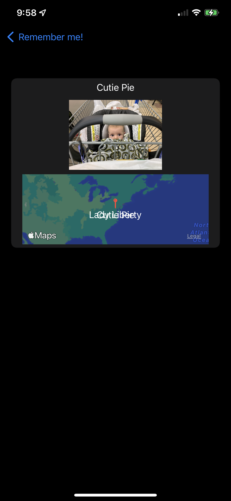

# RememberNames
 App to remember peoples names and faces. Day 77 challenge of 100 days of swift.

This is a fast and dirty first pass at a program that helps you remember peoples names. The interface is in a bad place and need to be refined, but the framework is there, it just needs to be cleaned up. The project includes accessing the photos system, using maps, and storing data.

  

If you are looking for help with the challenge please feel free to read through this code and implement things you might see. Appologies that there is not more commenting in the code, I try to use descriptive variable names that should help.

## TODO
1. make the pin drop system let you input a location instead of just dropping it where you currently are.
2. Correct the aspect ratio and cropping on the thumbnails
3. Streamline the photo process, bring up the camera in app and snap a shot then and there.
4. Interface cleanup / useability review
